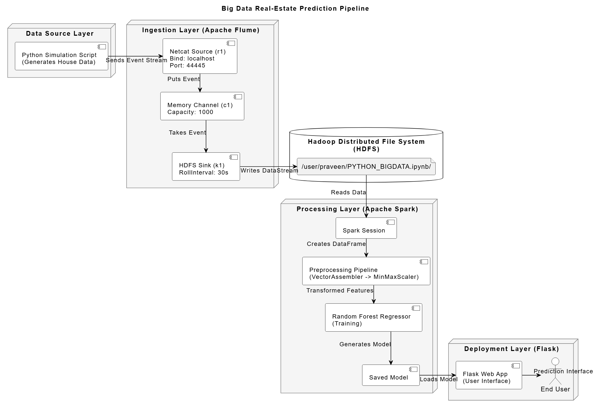

  
  # 🏡 Boston House Price Prediction: Real-Time Big Data Pipeline 🚀

  

    An end-to-end, distributed machine learning pipeline that simulates real-time data ingestion, distributed processing, and high-precision price forecasting using Apache Spark and the Hadoop Ecosystem.
  

  

    
    
    
    
    
  

---

## 📖 Table of Contents
- [Project Overview](#-project-overview)
- [System Architecture](#-system-architecture)
- [Data Engineering & Processing](#-data-engineering--processing)
- [Predictive Modeling](#-predictive-modeling)
- [Results & Performance](#-results--performance)
- [Web Deployment](#-web-deployment)
- [Quick Start](#-quick-start)

---

## 🚀 Project Overview

While traditional housing price predictions rely on static CSV files, real-world real estate platforms operate on continuous data streams. This project elevates the classic Boston Housing dataset by architecting a **production-ready Big Data environment**. It simulates live data generation and processes it through a highly scalable, distributed pipeline using Flume, Kafka, and PySpark to deliver near-perfect median house price (MEDV) predictions.

---

## 🏗️ System Architecture

The project utilizes a decoupled, multi-stage architecture to ensure maximum throughput and fault tolerance:

  

1. **Ingestion Layer:** A custom Python script generates simulated real-time housing events, sending them to **Apache Flume** via a Netcat source. **Apache Kafka** acts as a high-throughput buffer to decouple ingestion from storage.
2. **Storage Layer:** Buffered event streams are durably written to the **Hadoop Distributed File System (HDFS)** in 30-second roll intervals.
3. **Processing Layer:** **Apache Spark (PySpark)** pulls the data from HDFS, applying distributed data transformations, vectorization, and model inference.
4. **Deployment Layer:** A lightweight **Flask** web application serves the saved Spark model, providing an intuitive UI for end-users to get instant price estimates.

---

## ⚙️ Data Engineering & Processing

High data quality is achieved through a rigorous, distributed preprocessing pipeline executed in PySpark:
* **Iterative Outlier Removal (3xIQR):** Aggressively filters noise and extreme outliers (e.g., highly skewed crime rates) using exact quantiles.
* **Vector Assembly:** Consolidates all 13 features (CRIM, RM, AGE, etc.) into unified feature vectors for MLlib.
* **MinMax Scaling:** Normalizes features to a `[0, 1]` range to ensure smooth gradient descent and prevent large-magnitude features (like property tax) from dominating the model.

---

## 🧠 Predictive Modeling

The core predictive engine is built on Spark MLlib's **Random Forest Regressor**, chosen for its ability to capture complex, non-linear socio-economic and structural relationships without overfitting.

* **Algorithm:** Random Forest Regressor
* **Hyperparameters:** `numTrees: 100`, `maxDepth: 30`, `maxBins: 128`
* **Data Split:** 80% Training / 20% Testing

---

## 📊 Results & Performance

The distributed model achieved extraordinary accuracy on the test set, explaining virtually all variability in the housing prices:

| Metric | Score |
| :--- | :--- |
| **R-squared ($R^2$)** | `0.99998` |
| **RMSE** | `0.03846` |
| **MAE** | `0.01622` |
| **MSE** | `0.00148` |

  

---

## 🌐 Web Deployment

The trained PySpark model is serialized and integrated into a **Flask web application**. Users can input structural and neighborhood characteristics (like pupil-teacher ratio, proximity to highways, and number of rooms) into a sleek interface to receive real-time, Big Data-powered valuations.

  

---

## 💻 Quick Start

### Prerequisites
* Hadoop 3.4.0 & HDFS
* Apache Flume 1.11.0 & Apache Kafka 3.9.0
* Apache Spark 3.5.3 (PySpark)
* Python 3.11.4 & Flask
